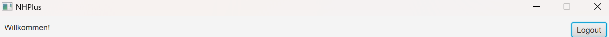
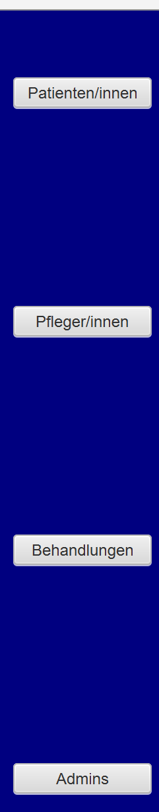
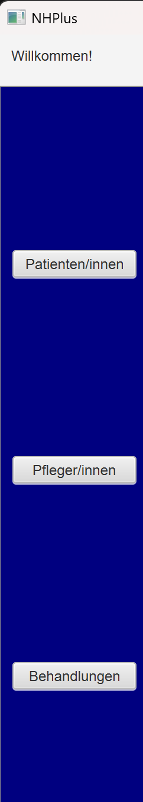
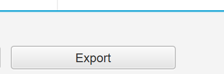
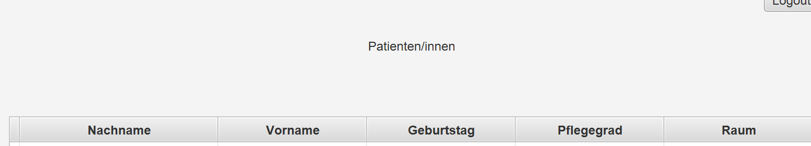

# LF05 Projekt NHPlus
## Gruppe: 
    Yasmine Khamilichi
    Tim Fallbrede
    Anton Nikishyn
    Rebecca Rupprecht

### Implementiert und erfolgreich getestet:
#### Login

#### Logout

#### Admin Permissions

#### Admin Tabelle

#### Datenbank verschlüsselt
#### Export von Patienten und Behandlungsdaten

#### löschen der Vermögensspalte

#### hinzufügen der Pflegertabelle und Testdaten

#### Treatement Archive
View ist fertig

### Nicht fertig
#### Treatement Archive
Es archiviert Daten nicht automatisch
